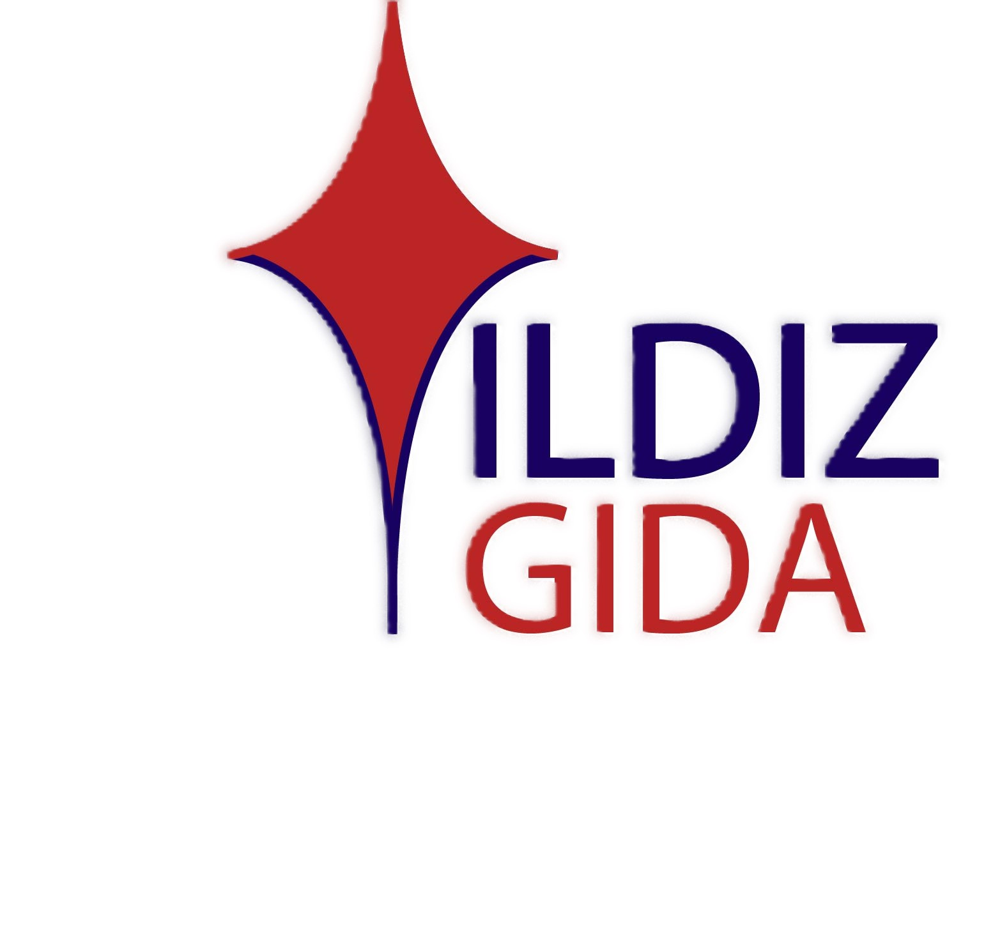
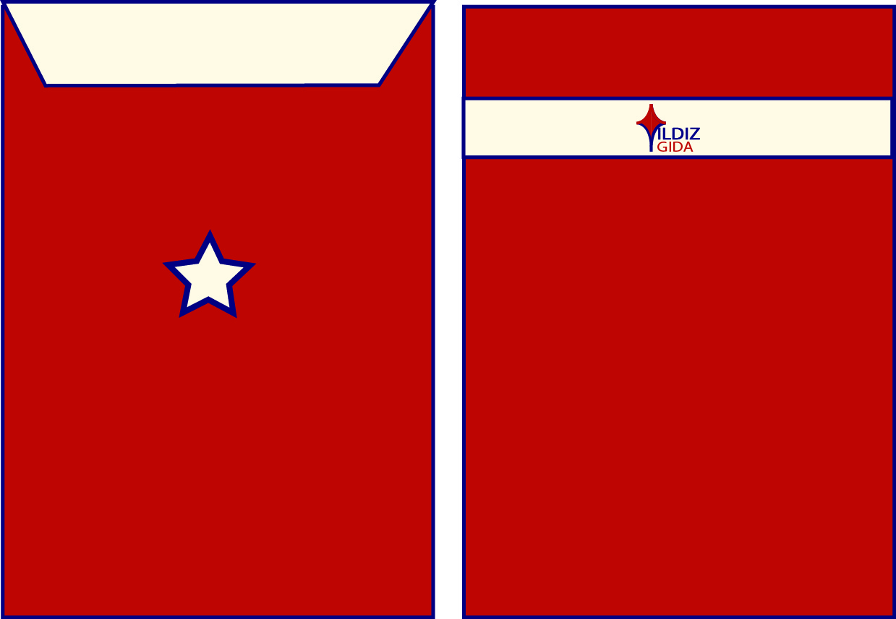

# 🌟 Yıldız Gıda - Kurumsal Kimlik ve E-Ticaret Web Arayüz Tasarımı

Bu proje, yöresel ve doğal gıda ürünleri satışı yapan **Yıldız Gıda** markası için sıfırdan tasarlanmış uçtan uca marka kimliği ve web sitesi arayüzü (UI) çalışmalarını içermektedir. 

Geleneksel lezzetleri modern ve güvenilir bir kurumsal yapıyla sunmayı hedefleyen marka için hem dijital ortamda (web sitesi) hem de fiziksel ortamda (basılı materyaller) tutarlı bir tasarım dili oluşturulmuştur.

## 📌 Proje Kapsamı

Tasarım süreci iki ana aşamada tamamlanmıştır:

### 1. Kurumsal Kimlik Tasarımı
Markanın vizyonunu yansıtan, akılda kalıcı ve kurumsal bir duruş sergileyen basılı materyaller tasarlanmıştır.
* **Özgün Logo Tasarımı** (Kırmızı ve lacivert tonlarında, markanın ismine atıfta bulunan yıldız formlu dinamik yapı)
* **Kartvizit Tasarımı** (Ön ve arka yüz, iletişim ve harita bilgileriyle)
* **Antetli Kağıt**
* **Kurumsal Zarf**
* **Dosya Kapağı**

### 2. Web Arayüzü (UI) Tasarımı
Kullanıcı deneyimi (UX) ön planda tutularak, e-ticaret dinamiklerine uygun bir arayüz tasarlanmıştır.
* **Anasayfa:** Kampanya slider'ı, "Haftanın Yıldızları" vitrini ve hızlı kategori erişimi.
* **Ürün Kataloğu (Baklagiller vb.):** Temiz ürün listeleme, net fiyatlandırma ve hızlı sepet yönetimi.
* **Hakkımızda Sayfası:** Marka hikayesi, görsel galeri ve fiziksel mağaza için harita entegrasyonu.
* **Kullanıcı Girişi:** Sade ve kullanıcıyı yormayan üyelik/giriş paneli.

---

## 🎨 Renk Paleti ve Tasarım Dili

* **Kırmızı & Lacivert:** Kurumsal kimlikte markanın ciddiyetini, güvenilirliğini ve enerjisini yansıtmak için tercih edilmiştir.
* **Krem/Bej Arka Planlar:** Doğallığı ve organikliği hissettirmek amacıyla özellikle basılı materyallerde fon olarak kullanılmıştır.
* **Turkuaz & Turuncu (Web):** Dijital ortamda kullanıcıyı eyleme geçmeye (sepete ekle, üye ol) teşvik etmek ve iştah açıcı bir atmosfer yaratmak için web arayüzünde tamamlayıcı renkler olarak konumlandırılmıştır.

---

## 🖼️ Tasarım Ön İzlemeleri

### 🏢 Kurumsal Kimlik Materyalleri

| Materyal | Tasarım Ön İzleme |
| :--- | :--- |
| **Logo Tasarımı** |  |
| **Kartvizit** |  |
| **Antetli Kağıt** |  |
| **Kurumsal Zarf** |  |
| **Dosya Kapağı** |  |
### 💻 Web Arayüzü Sayfaları

| Anasayfa | Ürünler Sayfası |
| :---: | :---: |
|  |  |

| Hakkımızda Sayfası | Kullanıcı Girişi |
| :---: | :---: |
|  |  |

---

## 🚀 Proje Kurulumu / İnceleme Bilgisi

Bu repo yalnızca tasarım dosyalarını ve ön izlemelerini içermektedir. Tasarımların kaynak dosyalarına erişmek veya detaylı incelemek isterseniz iletişim bilgilerim üzerinden bana ulaşabilirsiniz.

* **Tasarımcı:** [İlayda Yıldız]
* **İletişim / LinkedIn:** [https://www.linkedin.com/in/ilayda-y%C4%B1ld%C4%B1z-a666aa25b/?skipRedirect=true]
* **E-posta:**[ilaydayldz113@gmailcom]
  

*Bu proje, konsept bir tasarım çalışması ve portfolyo ürünüdür.*
